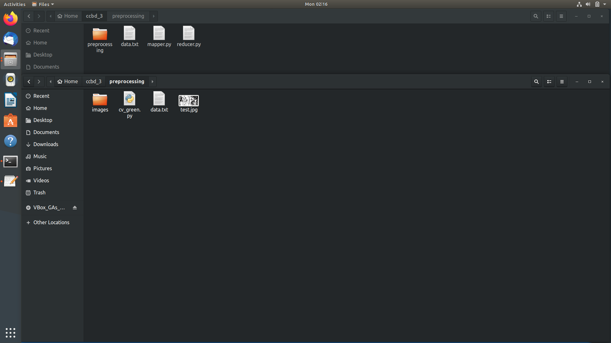
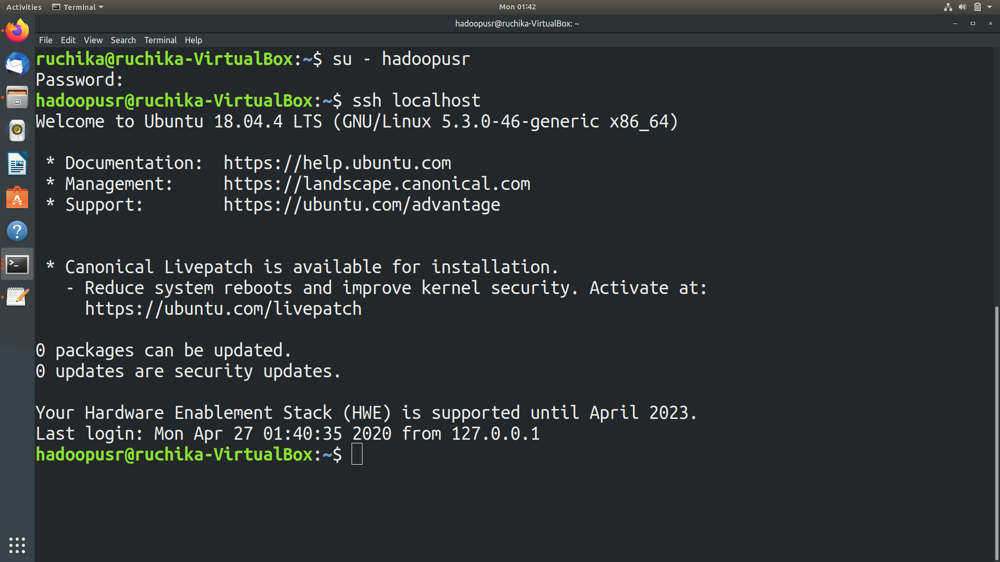
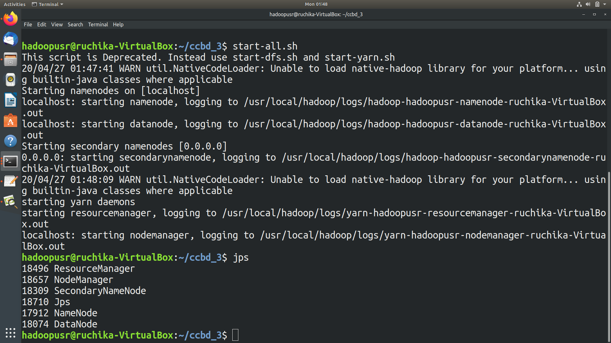
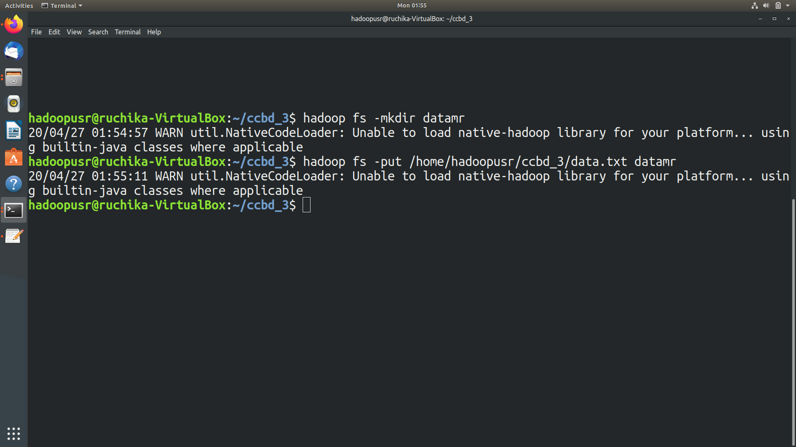
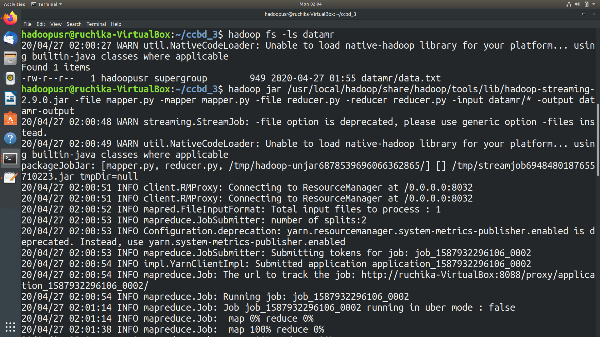
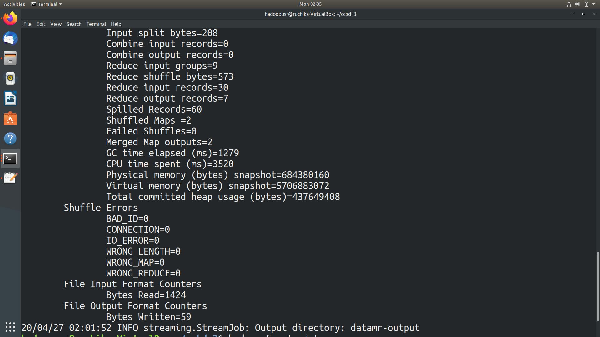
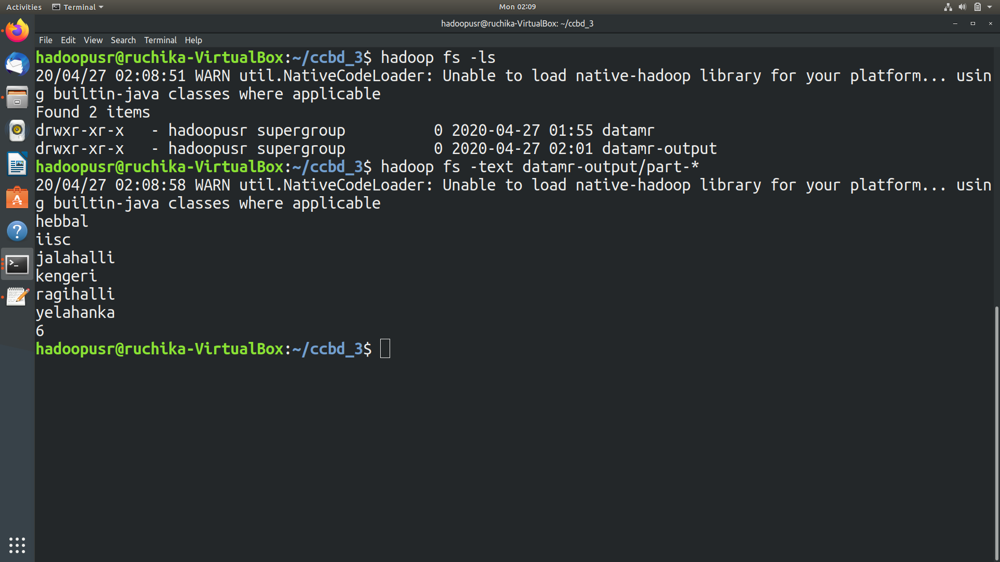
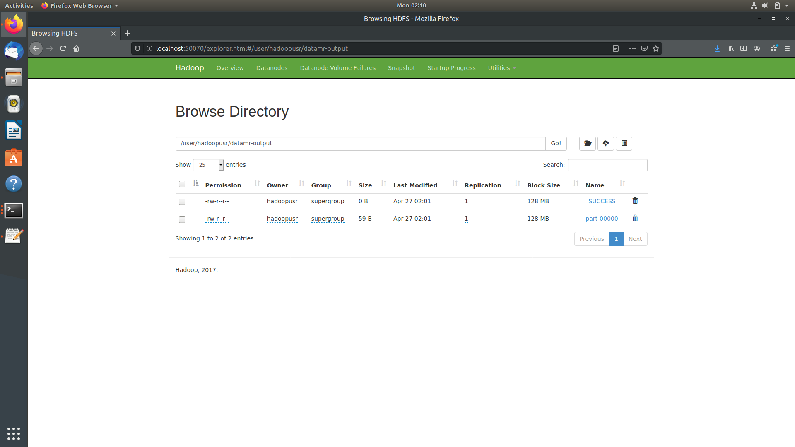
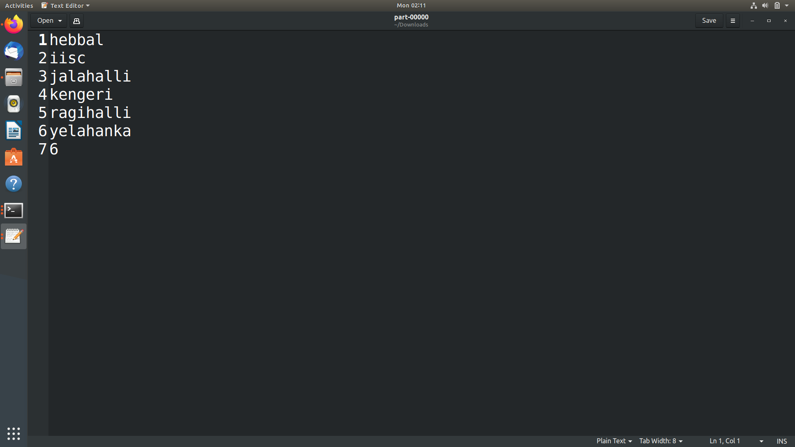
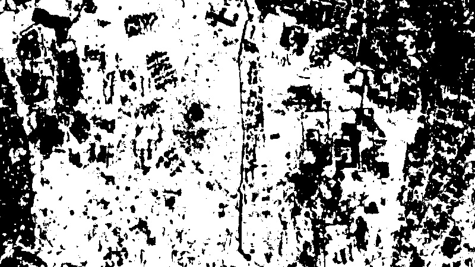

# Greenest Part

#### AIM: To calculate the areas in bangalore with area covered in greenery over 75%

### Preprocessing:

* Install opencv using the command:
    ```
    sudo apt install python3-opencv 
    ```
    Install numpy using the command: 
    ```
    pip3 install numpy 
    ```
* Login into <b><i>username</i></b> using your password.
  
* Clone this repository and copy it into a folder of your choice: 
    * In this case: ```ccbd_3```

    

* Run the command below to produce  <i>data.txt</i>
    ```python3 ./preprocessing/cv_green.py```


### Steps to run Map-Reduce Job:

* Install Hadoop on Ubuntu using the guide [here](https://www.youtube.com/watch?v=ieeCyhQ2PPM)
  
* Once the installation is complete, you will have two users on your system, <b><i>username</i></b> and hadoopusr.  
  
* Login into <b><i>username</i></b> using your password.
  
* Open Terminal in the user: <b><i>username</i></b>

* Use  the following command to login to the hadoopusr and then ssh into localhost:
    ```
    su - hadoopusr
    ssh localhost
    ```
    

* Enter password on prompt

* Run the following command to cd into the folder:
    ```cd /home/username/ccbd_3```

* To start all nodes:
    ```
    start-all.sh
    ```

* To check whether all nodes are running, use the ```jps``` command. The output should look similar to the image below.
    

* To make a folder in file system on hadoop, use the command below:
    ```
    hadoop fs -mkdir /datamr
    ```
* To copy data.txt from local system to hadoop file system , use the command below:
    ```
    hadoop fs -put /home/username/ccbd_3/data.txt /datamr
    ```
    
* To confirm whether its done or not, use the following command
    ```
    hadoop fs -ls /datamr
    ```
* The output of this command should look something like this.

* To run the task:
    ```
    hadoop jar /usr/local/hadoop/share/hadoop/tools/lib/hadoop-streaming-2.9.0.jar -file mapper.py -mapper mapper.py -file reducer.py -reducer reducer.py -input /datamr/* -output /datamr-output
    ```
    * You can use the following flag to define the number  of reduce tasks explicitly: 
        ```-D mapred.reduce.tasks=<number-of-tasks>```
    
    

* Use the following command to access the output:
    ```hadoop fs -text /datamr-output/part-*```
    

* Visit ```localhost:50070/explorer.html/user/hadoopusr``` to view the job result, the result should look similar to the image below.
    
* Click on ```data-output``` and then click on ```part-00000```
    
* Press Download to fetch a copy of the result of the map-reduce job 

* Open the file to view the result.
    

##### Note: File structure and port numbers may vary depending on the installation method.

##### Useful Commads: 

* Hadoop:
    * Start all nodes: ```start-all.sh```
    * Stop all nodes: ```stop-all.sh```
    * Format Namenode: ```hdfs namenode -format```
    * Java Virtual Machine Process Status Tool: ```jps```


* HDFS:
    * List all Directories and Files:
        ```hadoop dfs -ls /path/to/directory```
    * To make a folder in HDFS:
        ```hadoop fs -mkdir /path/to/folder```
    * To copy a folder from local system to HDFS:
        ```hadoop fs put /path/to/local/directory /path/to/hdfs/directory```
    * To delete a directory in HDFS:
        ```hadoop fs -rm -r /path/to/directory```
    * To view result of a Job:
        ```hadoop fs -text /path/to/output/part-*```

### Explaination: 
<b>Once the cv_green.py runs, these steps take place iteratively for each image in the /preprocessing/images folder:</b>
* The image is resized to a 16:9 ratio.
* Every single pixel is checked whether it has more green content in it compared to the other two, if yes - it is replaced with a white pixel else with a black pixel.
* At the end of the previous step, we get a black and white image where every green pixel is mapped to white and rest to black.
* The issue of using this however is that this approach avoids the dark spots in between the trees in the images, so to avoid this, we use the dilate method in open-cv which helps in covering these dark spots in between the trees.
* An example output image can be seen below:

* In this image, the black pixel clearly represent box-shaped house like structures.
* The number of white pixels divided by the total number of pixels in the image gives us the percentage greenery in the image.

Once this is done, we need to consider the fact that each area has multiple images. So we calculate the average greenery among all these images for the given area and consider this to be the final greenery percentage of that area. However, this can be used only when the scale of all the images are the same and this was taken care of while collecting these Satellite images. 
